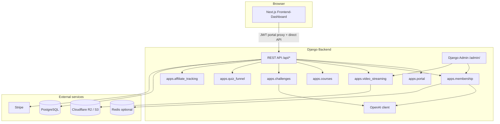

# Syndicate — Project Overview

This document describes the **Syndicate** monorepo: what it is, how it is structured, and how the main product areas connect. For setup commands, see [README.md](./README.md). For deployment, see [Backend/docs/HOSTING_RAILWAY_R2.md](./Backend/docs/HOSTING_RAILWAY_R2.md).

---

## What this project is

**Syndicate** is a full-stack membership and education platform. It combines:

- A **marketing site** and **member dashboard** (Next.js)
- A **Django REST API** for auth, billing, courses, video streaming, membership content, AI features, and affiliate tracking
- **Admin-managed content** (playlists, videos, articles, keyword datasets) via Django admin
- **Stripe** checkout for plans and individual program playlists
- **Cloudflare R2 / S3** for private video storage and signed playback URLs

The product targets operators and members with programs (video playlists), a membership content hub (articles + secure videos), daily AI missions/challenges, quiz funnel, affiliate portal, and support flows.

---

## High-level architecture



| Layer | Technology |
|--------|------------|
| Frontend | Next.js 16 (App Router), React 19, Tailwind CSS 4, GSAP, Framer Motion |
| Backend | Django 4.2, Django REST Framework |
| Auth | JWT (portal/dashboard), DRF Token (Syndicate missions), OTP + Stripe (accounts) |
| AI | OpenAI (`OPENAI_API_KEY`, default model via env) |
| Database | PostgreSQL (production), SQLite (local dev) |
| Video | MP4 on R2/S3, presigned URLs, multipart admin upload |
| Deploy | Railway (typical), optional Redis/Celery |

---

## Repository layout

```
Syndicate_real1/
├── Backend/                    # Django project (syndicate_backend)
│   ├── syndicate_backend/      # Settings, root URLs, WSGI
│   ├── api/                    # Shared API views, OpenAI client, prompts
│   ├── accounts/               # OTP signup/login, Stripe checkout sessions
│   ├── apps/
│   │   ├── portal/             # JWT auth, portal user profile, billing purchases
│   │   ├── membership/         # Articles, videos, keyword datasets, search
│   │   ├── video_streaming/    # Playlists, StreamVideo, R2 playback, checkout
│   │   ├── courses/            # Legacy course lessons + progress
│   │   ├── challenges/         # AI missions panel (Syndicate mode)
│   │   ├── quiz_funnel/        # Syn Diagnosis quiz API
│   │   ├── affiliate_tracking/ # Clicks, affiliate OTP auth
│   │   └── support/            # Support ticket API
│   ├── docs/                   # Hosting, R2, video streaming guides
│   ├── fixtures/               # e.g. stream_playlist_backup.json
│   └── requirements.txt
│
├── Frontend-Dashboard/         # Next.js app (port 3000)
│   ├── src/app/                # Routes (pages)
│   ├── src/components/         # UI by feature (programs, membership, dashboard…)
│   ├── src/lib/                # API clients, streaming-api, portal-api
│   └── public/                 # Static assets, program globe images
│
├── README.md                   # Quick start
└── PROJECT_OVERVIEW.md         # This file
```

---

## Backend applications

### `apps.portal`

- JWT login, refresh, logout, `/api/auth/me/`
- Billing purchase history (`/api/auth/billing-purchases/`)
- Portal-specific endpoints under `/api/portal/`

### `apps.membership`

Member-facing content hub and AI article pipeline.

| Feature | Description |
|---------|-------------|
| **Articles** | Published articles with tags, search, optional PDF |
| **Keyword datasets** | Admin uploads CSV, DOCX, or PDF → parsed rows stored as JSON |
| **Article generation** | Rows drive OpenAI briefs; title/description/body grounded in dataset text |
| **Daily generation** | One auto-generated `operator-brief` article per server calendar day |
| **Videos** | URL-based membership videos + secure StreamVideo playback |
| **Search** | Full-text search; optional Redis inverted index |

**Admin:** `ArticleKeywordDataset`, `Article`, `Video`, `MembershipStreamVideo`, generation state.

**Key API prefix:** `/api/portal/membership/`

### `apps.video_streaming`

Programs library: purchasable **playlists** of **StreamVideo** items.

| Feature | Description |
|---------|-------------|
| **Playlists** | Categories (business model / psychology), pricing, unlock flags |
| **Playback** | Signed MP4 URLs from R2 (`/api/streaming/videos/stream/<id>/`) |
| **Checkout** | Stripe session per playlist |
| **Certificates** | Issue certificate after playlist completion |
| **Upload** | Multipart upload to R2 from Django admin |

**Public catalog:** `/api/streaming/public-playlists/` (no auth).

### `apps.courses`

Older **course + lesson video** model with progress tracking. Still used in parts of the dashboard; programs UX increasingly uses `video_streaming` playlists.

### `apps.challenges`

AI-generated daily missions, scoring, streaks, leaderboard — Syndicate mode panel in the dashboard. Token auth at `/api/syndicate-auth/*`.

### `apps.quiz_funnel`

Syn Diagnosis quiz: fetch questions, submit answers, AI-generated result reports.

### `apps.affiliate_tracking`

Affiliate link tracking (`/api/track/*`) and affiliate OTP login (`/api/affiliate/auth/*`).

### `apps.support`

Support contact / ticket endpoints.

### `api` (package)

Shared services: **OpenAI client**, prompt templates, document ingest, health checks, mindset status, syndicate bootstrap.

---

## Frontend routes (main pages)

| Route | Purpose |
|-------|---------|
| `/` | Marketing homepage, 3D program globe, marquees |
| `/programs` | Public programs library + plan offers |
| `/dashboard` | Authenticated control center (programs, goals, Syndicate panel) |
| `/membership` | Membership hub (articles, secure videos) |
| `/membership/articles/[slug]` | Article reader |
| `/login`, `/signup`, `/verify` | Portal auth |
| `/syndicate-otp/*` | Member OTP onboarding flow |
| `/checkout`, `/checkout/success` | Stripe return URLs |
| `/quiz`, `/quiz/questions`, `/quiz/result` | Syn Diagnosis funnel |
| `/affiliate`, `/affiliate-login` | Affiliate marketing + login |
| `/streaming/videos` | Stream video catalog (internal/dev-style) |
| `/our-methods`, `/what-you-get` | Marketing content |

The Next app proxies authenticated API calls through **`/api/portal-proxy/`** (see `src/lib/portal-api.ts`) and uses **`NEXT_PUBLIC_SYNDICATE_API_URL`** for direct backend calls where needed.

---

## Core user flows

### 1. Browse and unlock a program

1. User visits `/programs` or clicks a globe tile → deep link `?program={id}`.
2. Frontend loads public playlists from `/api/streaming/public-playlists/`.
3. Locked playlist → Stripe checkout via `/api/streaming/playlists/{id}/checkout/`.
4. After unlock, user opens playlist in dashboard → `StreamPlaylistProgramPanel`.
5. Videos prefetch signed URLs in parallel; MP4 plays via `StreamHtmlVideoPlayer`.

### 2. Membership articles from dataset

1. Admin uploads dataset in **Django admin → Article keyword datasets** (CSV with `category`, `keyword`, `title`, `description`, `content` columns, or PDF/DOCX for AI extraction).
2. Mark dataset **active**; optionally click **Generate 60 articles**.
3. Each row becomes an article: OpenAI **rewrites** dataset fields in simple English (no invented facts).
4. Members see articles in `/membership`; one new brief can auto-generate per day when the articles tab opens.

### 3. Member login and dashboard

1. OTP or JWT login → tokens stored client-side.
2. Dashboard loads courses, playlists, progress, Syndicate challenges, certificates.
3. Goal path and program cards tie into the same streaming/course APIs.

---

## Content management (Django admin)

| Admin section | What you manage |
|---------------|-----------------|
| **Article keyword datasets** | Upload file, preview rows, generate articles |
| **Articles** | Title, slug, body, tags, PDF, seed vs dataset check |
| **Stream playlists / Stream videos** | Program catalog, video files, R2 upload |
| **Membership stream videos** | Secure videos shown in membership hub |
| **Courses / Videos** | Legacy lesson library |

Admin URL (production example): `https://<backend-host>/admin/`

---

## Environment variables (essentials)

### Backend (`Backend/.env`)

| Variable | Purpose |
|----------|---------|
| `DJANGO_SECRET_KEY` | Django secret |
| `DATABASE_URL` | PostgreSQL (Railway) |
| `OPENAI_API_KEY` | Article generation, quiz, challenges, keyword extraction |
| `AWS_*` / R2 vars | S3-compatible storage for videos |
| `STRIPE_*` | Checkout |
| `REDIS_URL` | Optional membership search index |
| `ALLOWED_HOSTS`, `CORS_*` | Production domains |

See `Backend/env.example` for the full list.

### Frontend (`Frontend-Dashboard/.env.local`)

| Variable | Purpose |
|----------|---------|
| `BACKEND_INTERNAL_URL` | Server-side proxy to Django |
| `NEXT_PUBLIC_SYNDICATE_API_URL` | Browser API base (must end with `/api`) |
| `NEXT_PUBLIC_STRIPE_PUBLISHABLE_KEY` | Stripe.js |

See `Frontend-Dashboard/.env.example`.

---

## Local development

```bash
# Backend
cd Backend
python -m venv .venv
.venv\Scripts\activate          # Windows
pip install -r requirements.txt
copy env.example .env             # configure keys
python manage.py migrate
python manage.py runserver        # http://127.0.0.1:8000

# Frontend
cd Frontend-Dashboard
npm install
copy .env.example .env.local
npm run dev                       # http://localhost:3000
```

- API health: `http://127.0.0.1:8000/api/health/`
- Admin: `http://127.0.0.1:8000/admin/`

---

## Deployment

Typical production setup:

- **Railway** — Django backend + PostgreSQL + optional Redis worker
- **Railway / Vercel** — Next.js frontend
- **Cloudflare R2** — Private video bucket + CORS for browser playback

Guides:

- [HOSTING_RAILWAY_R2.md](./Backend/docs/HOSTING_RAILWAY_R2.md)
- [RAILWAY_GIT_AUTO_DEPLOY.md](./Backend/docs/RAILWAY_GIT_AUTO_DEPLOY.md)
- [VIDEO_STREAMING.md](./Backend/docs/VIDEO_STREAMING.md)
- [R2_PLAYBACK_TROUBLESHOOTING.md](./Backend/docs/R2_PLAYBACK_TROUBLESHOOTING.md)

---

## Key frontend modules

| Path | Role |
|------|------|
| `src/lib/streaming-api.ts` | Playlists, playback URLs, prefetch, checkout |
| `src/lib/portal-api.ts` | JWT auth, portal proxy fetch |
| `src/components/programs/StreamPlaylistProgramPanel.tsx` | In-dashboard playlist player |
| `src/components/membership/MembershipContentHub.tsx` | Articles + videos tab |
| `src/hooks/useStreamPlaybackRefresh.ts` | Signed URL load + expiry refresh |
| `src/lib/programPlaylistThumbnails.ts` | Static covers for program cards |

---

## Key backend modules

| Path | Role |
|------|------|
| `apps/membership/services/article_from_dataset.py` | Generate articles from dataset rows |
| `apps/membership/keyword_dataset.py` | Parse CSV/DOCX/PDF uploads |
| `apps/membership/dataset_match.py` | Match article seeds to dataset rows |
| `api/services/openai_client.py` | OpenAI calls (articles, quiz, challenges) |
| `api/services/prompts.py` | System prompts |
| `apps/video_streaming/` | Playlists, R2 storage, signed playback |

---

## Related documentation

- [README.md](./README.md) — Setup, globe/programs deep links, tech stack summary
- [Frontend-Dashboard/README.md](./Frontend-Dashboard/README.md) — Frontend-specific notes
- [Backend/docs/](./Backend/docs/) — Hosting and video troubleshooting

---

## License

Add your license if you publish this repository publicly.
