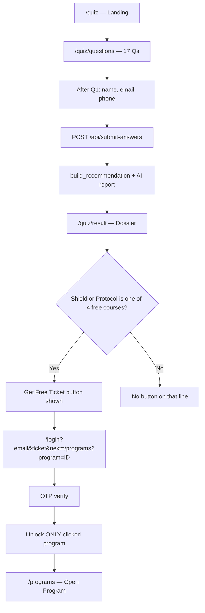

# Sovereign Entity Audit — Quiz Funnel Workflow

Complete reference: how the quiz works, what users see, recommendation logic, and **free-ticket** rules.

---

## Quick answers

### What is the quiz funnel?

A **17-question audit** (`/quiz` → `/quiz/questions` → `/quiz/result`) that scores the user, assigns an archetype and psychological “virus,” builds a **Weapon + Shield + Protocol** course stack, generates an AI dossier, and optionally unlocks **one free psychology program** per ticket claim.

### Which courses are FREE (free ticket)?

**Only these 4 psychology programs** — never business models:

| # | Free-ticket course (report name) | Programs page ID | DB playlist title |
|---|----------------------------------|------------------|-------------------|
| 1 | **Secret To Transformation** | 9 | The Secret To Transformation |
| 2 | **The Micro Business Protocol** | 30 | The Micro Business Protocol |
| 3 | **Zero to 1 Million** | 2 | Zero to One Million |
| 4 | **Mastering Risk and Uncertainty** | 31 | Mastering Risk and Uncertainty |

### Which courses are NOT free?

- **All 12 business models (Weapon)** — e.g. Amazon KDP, AI Automation, Python Full Course, etc.  
  → Recommended in the report, **no Get Free Ticket button**, **no free unlock**.

- **Other psychology courses** — e.g. Business Warfare, 9 to 5 Exit Strategy, Hustle Hard, Compound Effect  
  → Can appear as Shield or Protocol in the report, **no free ticket** unless they are one of the 4 above.

### Free ticket in one sentence

User clicks **Get Free Ticket** on a Shield/Protocol line → **login with quiz email** → **OTP verify** → **only that one program unlocks** → redirect to **`/programs?program={id}`**.

---

## Table of contents

1. [End-to-end user journey](#end-to-end-user-journey)
2. [What the user sees](#what-the-user-sees-at-each-step)
3. [Recommendation engine logic](#recommendation-engine-logic)
4. [Allowed course catalogs](#allowed-course-catalogs)
5. [Free ticket flow (full detail)](#free-ticket-flow-full-detail)
6. [AI report](#ai-report-structure)
7. [API endpoints](#api-endpoints)
8. [Key files](#key-files)
9. [Worked example](#worked-example)

---

## End-to-end user journey



---

## What the user sees at each step

### 1. Landing — `/quiz`

- Headline + value props for the Sovereign Entity Audit  
- CTA: **BEGIN THE SOVEREIGN ENTITY AUDIT** → `/quiz/questions`

### 2. Questions — `/quiz/questions`

| Element | Detail |
|--------|--------|
| Questions | 17 total, sections: Diagnostic (1–4), Strengths (5–7), Fatal Flaws (8–11), Grind (12–17) |
| Scoring | A=1, B=3, C=5, D=10 |
| Lead gate | After **Q1**, modal: name → email → phone (required) |
| Email note | “Free ticket will be linked to this email only.” |
| Storage | `quiz_result` + `quiz_user_email` in `localStorage` after submit |

### 3. Result — `/quiz/result`

| Section | Content |
|---------|---------|
| A | Designation + archetype |
| B | Detected virus + diagnosis |
| C | **Weapon** (business model), **Shield** (psychology), **Protocol** (psychology) |
| D | Final directive / 48-hour CTA |
| Free ticket | Button **only** on Shield/Protocol lines when course name is one of the [4 free courses](#which-courses-are-free-free-ticket) |
| PDF | Download dossier |

**Button visibility logic (frontend):**

```
For each "• Course: …" line in Section C:
  IF course name is in FREE_TICKET list → show "Get Free Ticket"
  ELSE → no button
```

Weapon lines never qualify (business models are never in the free list).

### 4. After free ticket click

| Step | URL / action |
|------|----------------|
| Login | `/login?email={quizEmail}&ticket={courseName}&next=/programs?program={id}#programs-library` |
| OTP | User enters 6-digit code; `ticket` sent to backend |
| Unlock | Backend creates `$0` paid `StreamPlaylistPurchase` for **that playlist only** |
| Redirect | Public programs page, program card highlighted |
| Open | **Open Program** → dashboard program viewer |

---

## Recommendation engine logic

On `POST /api/submit-answers`:

```
answers[]
  → compute_score()           sum(A/B/C/D) → 17–170
  → get_designation()         score → Street Soldier / Rogue Operator / …
  → detect_archetype()        votes from Q5, Q6, Q7
  → detect_virus()            Q4, Q8–11, Q16 (Q8 wins ties)
  → get_weapon_course()       archetype + Q14 budget + Q5 index
  → get_recommended_shield()  virus + archetype psychology pool
  → get_recommended_protocol() designation → fixed protocol course
  → generate_ai_report()
  → save Result + User
```

### Designation (from score)

| Score | Designation |
|-------|-------------|
| 17–50 | Street Soldier |
| 51–100 | Rogue Operator |
| 101–140 | Syndicate Specialist |
| 141–170 | Prospect |

### Protocol (from designation only)

| Designation | Protocol course |
|-------------|-----------------|
| Street Soldier | Secret To Transformation |
| Rogue Operator | 9 to 5 Exit Strategy |
| Syndicate Specialist | Mastering Risk and Uncertainty |
| Prospect | 13 Syndicate Business Rule |

### Archetype (Q5 + Q6 + Q7 votes)

| Q | A | B | C | D |
|---|---|---|---|---|
| Q5 | Digital Raider | Creative Infiltrator | Asset Grinder | Ghost Architect |
| Q6 | Digital Raider | Creative Infiltrator | Ghost Architect | Asset Grinder |
| Q7 | Digital Raider | Ghost Architect | Creative Infiltrator | Asset Grinder |

Tie-break: Ghost Architect → Digital Raider → Creative Infiltrator → Asset Grinder.

### Weapon (business model)

- **Q14** A/B = entry pool, C/D = elite pool  
- **Q5 letter** picks index in pool (A=0, B=1, C=2, D=3 mod pool size)  
- Pool depends on archetype (see `ARCHETYPE_WEAPON_MODELS` in `logic.py`)

### Shield (psychology)

1. Look up virus in `ARCHETYPE_VIRUS_SHIELD[archetype]`  
2. Else fallback `SHIELD_BY_VIRUS[virus]`

### Virus detection

- Triggered by specific Q+option pairs (Q4, Q8–11, Q16)  
- **Q8 always wins** if it triggered a virus  
- Else first match in `VIRUS_PRIORITY` order

### Course allowlists

Reports may **only** use courses from:

- **12 business models** (Weapon)  
- **11 psychology courses** (Shield / Protocol)

**Banned everywhere:** The Art Of Business Persuasion

---

## Allowed course catalogs

### Business models — 12 (Weapon only, **never free**)

AI Automation · App Building using Flutter · Python Full Course · Amazon KDP · Build a Real React App · Building Games Using Unreal Engine · Framer Crash Course · Wordpress Blog · Print On Demand · FULL CANVA TUTORIAL · N8N AI Automation · Trading advanced technical analysis

### Psychology — 11 (Shield / Protocol in reports)

Business Warfare · Money Philosophy · 13 Syndicate Business Rule · Zero to 1 Million · 9 to 5 Exit Strategy · Compound Effect · The Micro Business Protocol · Hustle Hard · Mastering Consistency · Secret To Transformation · Mastering Risk and Uncertainty

### Report name → DB playlist (for paid enrollments / tickets)

| Report name | DB playlist |
|-------------|-------------|
| Zero to 1 Million | Zero to One Million |
| Secret To Transformation | The Secret To Transformation |
| The Micro Business Protocol | The Micro Business Protocol |
| Mastering Risk and Uncertainty | Mastering Risk and Uncertainty |
| AI Automation / N8N | AI Automations |
| Python Full Course | Python Programming |
| Amazon KDP | Book Publishing On Amazon (KINDLE) |
| *(others)* | See `WEAPON_TO_PLAYLIST` / `PSYCHOLOGY_TO_PLAYLIST` in `logic.py` |

---

## Free ticket flow (full detail)

### When does the button appear?

The **Get Free Ticket** button shows on the result page **if and only if**:

1. The line is `• Course: {name}` in Section C (Shield or Protocol), **and**
2. `{name}` exactly matches one of the **4 free-ticket courses** (case-insensitive).

Examples:

| Shield / Protocol in report | Free ticket button? |
|----------------------------|---------------------|
| The Micro Business Protocol | ✅ Yes |
| Secret To Transformation | ✅ Yes |
| Zero to 1 Million | ✅ Yes |
| Mastering Risk and Uncertainty | ✅ Yes |
| 9 to 5 Exit Strategy | ❌ No |
| Business Warfare | ❌ No |
| Amazon KDP (Weapon) | ❌ No — Weapon never has button |

### What happens when user clicks Get Free Ticket?

**Step 1 — Frontend builds login URL**

```
/login
  ?email={quiz_user_email}
  &ticket={clicked course name}
  &next=/programs?program={id}#programs-library
```

Program IDs: Secret=9, Micro=30, Zero=2, Risk=31 (`quizFreeTicketCourses.ts`).

**Step 2 — User logs in (OTP)**

- `AuthScreen` sends `{ email, otp, ticket }` to `POST /api/auth/verify-login-otp/` (or equivalent).
- Email **must match** the email used in the quiz (`Result.user.email`).

**Step 3 — Backend unlock logic** (`_ensure_quiz_ticket_user_and_enrollment`)

```
1. Find quiz Result for email
2. IF ticket param is one of 4 free courses:
     playlist_title = map catalog name → DB playlist title
     ticket_titles = existing_unlocks + [this playlist only]
   ELSE IF user already has ticket unlocks:
     keep existing
   ELSE:
     ticket_titles = shield/protocol from result IF in free list (auto path)
3. Create StreamPlaylistPurchase (status=PAID, amount=0, session=quiz_ticket_*)
4. Optional CourseEnrollment for matching course row
```

**Important rules:**

| Rule | Behavior |
|------|----------|
| One click = one unlock | Clicking Micro Business unlocks **only** playlist #30, not all 4 |
| Two eligible lines | User can claim Shield and Protocol separately → up to 2 free programs |
| Wrong email | No quiz result match → no unlock |
| Weapon courses | Never eligible for free ticket |
| Prior unlocks | New claim **adds** to existing ticket unlocks (does not remove them) |

**Step 4 — Redirect**

After OTP success → `next` URL → `/programs?program={id}#programs-library`

**Step 5 — Programs page**

- Logged-in user sees playlist with `is_unlocked: true`  
- Button: **Open Program** → `/dashboard?section=programs&playlist={id}`

### Free ticket decision tree (backend)

```
verify_login_otp(ticket= "...")
  │
  ├─ is_free_ticket_psychology_course(ticket)?
  │     YES → unlock ONLY free_ticket_playlist_title_for_catalog(ticket)
  │           merge with any prior quiz_ticket unlocks for this email
  │
  ├─ user has existing_locked_ticket_titles?
  │     YES → keep those
  │
  └─ else → unlock free_ticket_playlist_titles_from_stack(shield, protocol)
            (only courses in the 4 that appear in stack)
```

---

## AI report structure

```
THE SOVEREIGN ENTITY AUDIT: DOSSIER {USER_ID}

Section A: Designation (status, archetype, analysis)
Section B: Virus (detected flaw, sting, reality, urgency)
Section C: Execution Stack
  1. THE WEAPON  → business model (never free)
  2. THE SHIELD  → psychology (free button if in 4 list)
  3. THE PROTOCOL → psychology (free button if in 4 list)
Section D: Final Directive
```

AI prompt forbids mentioning course titles outside the three assigned names.

---

## API endpoints

| Method | Path | Purpose |
|--------|------|---------|
| GET | `/api/quiz-questions` | All questions + options |
| POST | `/api/submit-answers` | Submit answers + user; returns stack + `ai_report` |
| POST | `/api/auth/verify-login-otp/` | OTP login; `ticket` triggers free unlock |

---

## Key files

| Area | Path |
|------|------|
| Questions | `Backend/apps/quiz_funnel/quiz_data.py` |
| Recommendation + free-ticket catalog | `Backend/apps/quiz_funnel/logic.py` |
| Submit API | `Backend/apps/quiz_funnel/views.py` |
| AI report | `Backend/apps/quiz_funnel/ai_service.py` |
| Ticket enrollment | `Backend/accounts/views.py` |
| Free ticket UI + URLs | `Frontend-Dashboard/src/lib/quizFreeTicketCourses.ts` |
| Result page buttons | `Frontend-Dashboard/src/app/quiz/result/page.tsx` |
| Programs unlock UI | `Frontend-Dashboard/src/components/programs/PlaylistCardsSection.tsx` |
| Playlist title migration | `Backend/apps/video_streaming/migrations/0021_free_ticket_playlist_titles.py` |

---

## Worked example

**Answers:** Mostly B; Q5=A, Q6=B, Q7=C, Q8=B (Spender), Q14=C  

**Output:**

| Field | Value |
|-------|--------|
| Score | 49 → **Street Soldier** |
| Archetype | **Creative Infiltrator** |
| Virus | **Spender** |
| Weapon | Amazon KDP *(not free)* |
| Shield | The Micro Business Protocol *(free ✅)* |
| Protocol | Secret To Transformation *(free ✅)* |

**Result page:**

- THE WEAPON → Amazon KDP — **no button**
- THE SHIELD → The Micro Business Protocol — **Get Free Ticket**
- THE PROTOCOL → Secret To Transformation — **Get Free Ticket**

**User clicks Shield free ticket:**

1. `/login?email=…&ticket=The Micro Business Protocol&next=/programs?program=30#programs-library`
2. OTP verify with `ticket` param
3. Unlock **only** playlist “The Micro Business Protocol” (id **30**)
4. Land on `/programs?program=30` → **Open Program**

If user later clicks Protocol free ticket → **additionally** unlocks “The Secret To Transformation” (id **9**) only — still not Amazon KDP or all four at once.

---

*Last updated: Sovereign Entity Audit v17 — single-course free ticket, program IDs 9 / 30 / 2 / 31.*
