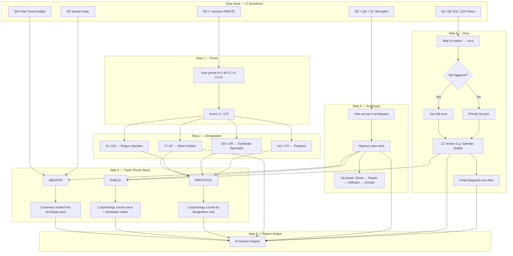
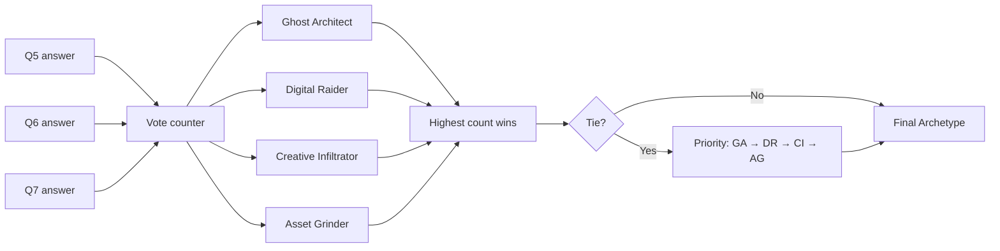
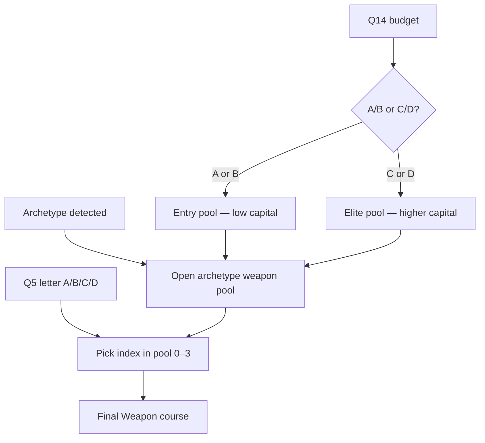
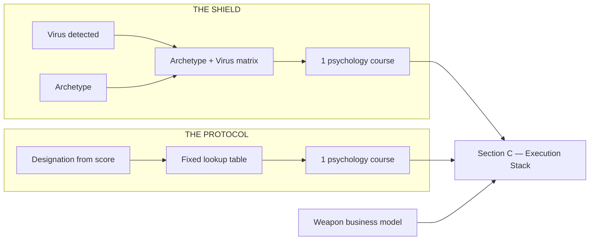
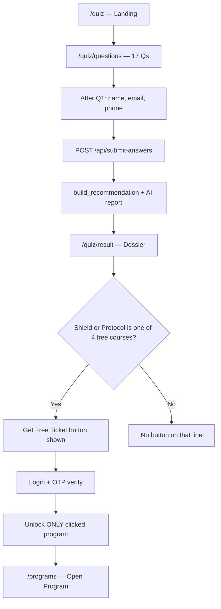

# Sovereign Entity Audit — Detection & Course Logic

Complete reference for how the **17-question quiz** produces **Designation**, **Archetype**, **Virus**, and the **Weapon + Shield + Protocol** course stack.

---

## Table of contents

1. [Overview](#overview)
2. [How designation is detected](#1-how-designation-is-detected)
3. [How archetype is detected](#2-how-archetype-is-detected)
4. [How virus is detected](#3-how-virus-is-detected)
5. [How courses are offered](#4-how-courses-are-offered)
6. [Full course catalog](#5-full-course-catalog)
7. [Diagrams](#6-diagrams)
8. [Worked example](#7-worked-example)
9. [One-page summary](#8-one-page-summary)

---

## Overview

When a user submits the quiz, the backend runs a **deterministic rules engine** (`logic.py`) — not random AI logic.

```
User answers 17 questions (A/B/C/D)
        ↓
Backend runs fixed rules
        ↓
Produces: Score → Designation → Archetype → Virus → 3 Courses → AI Report
```

The AI only **writes the narrative**. It does **not** choose the courses.

### Report structure

```
THE SOVEREIGN ENTITY AUDIT: DOSSIER {USER_ID}

Section A: The Designation     → status + archetype + analysis
Section B: The Virus           → detected flaw + diagnosis
Section C: Execution Stack     → Weapon + Shield + Protocol
Section D: Final Directive     → 48-hour urgency CTA
```

---

## 1. How designation is detected

### Input

All **17 answers** are scored:

| Answer | Points |
|--------|--------|
| A | 1 |
| B | 3 |
| C | 5 |
| D | 10 |

**Total score range: 17 to 170**

### Rule

Designation comes **only from total score**. Nothing else affects it.

| Score | Designation | Meaning |
|-------|-------------|---------|
| 17–50 | **Street Soldier** | Early stage — needs foundation |
| 51–100 | **Rogue Operator** | Building momentum |
| 101–140 | **Syndicate Specialist** | Strong operator mindset |
| 141–170 | **Prospect** | Highest tier — empire mindset |

### Used for

- Section A of the report (STATUS)
- **Protocol** course selection

---

## 2. How archetype is detected

### Input

**Only 3 questions** — Section 2 (Strengths):

| Question | Topic |
|----------|--------|
| **Q5** | How they'd make $5,000 with a laptop |
| **Q6** | Their strongest weapon in a deal |
| **Q7** | Which "system glitch" interests them most |

### Rule: voting system

Each answer (A/B/C/D) on Q5, Q6, and Q7 maps to **one archetype**. The system counts votes. **Most votes wins.**

#### Q5 mapping

| A | B | C | D |
|---|---|---|---|
| Digital Raider | Creative Infiltrator | Asset Grinder | Ghost Architect |

#### Q6 mapping

| A | B | C | D |
|---|---|---|---|
| Digital Raider | Creative Infiltrator | Ghost Architect | Asset Grinder |

#### Q7 mapping

| A | B | C | D |
|---|---|---|---|
| Digital Raider | Ghost Architect | Creative Infiltrator | Asset Grinder |

### Tie-break (if 2+ archetypes tie)

Priority order:

1. Ghost Architect
2. Digital Raider
3. Creative Infiltrator
4. Asset Grinder

### Default

If Q5–Q7 have no valid answers → **Asset Grinder**

### The 4 archetypes

| Archetype | Profile |
|-----------|---------|
| **Ghost Architect** | Builder, coder, systems/logic thinker |
| **Digital Raider** | Marketer, flipper, fast mover, talker |
| **Creative Infiltrator** | Content, design, brand, influence |
| **Asset Grinder** | Hustler, grind, publishing, automation |

### Used for

- Section A of the report (ARCHETYPE)
- **Weapon** course pool
- **Shield** course pool

---

## 3. How virus is detected

The **Virus** is the user's main psychological blocker ("fatal flaw").

### Input questions

| Question | Section | Role |
|----------|---------|------|
| **Q4** | Diagnostic | Can trigger Employee |
| **Q8** | Fatal Flaws | **Primary — always wins if triggered** |
| **Q9** | Fatal Flaws | Quitter, Emotional Mover, Amateur, Visionary |
| **Q10** | Fatal Flaws | Loner, Spender, Amateur, Visionary |
| **Q11** | Fatal Flaws | Victim, Spender, Loner, Chaos Agent |
| **Q16** | Grind | Order Taker, Identity Crisis, Slow Burner |

### All 12 possible viruses

| Virus | Plain meaning |
|-------|----------------|
| Quitter | Gives up when hype fades |
| Employee | Still thinks like a worker, not owner |
| Chaos Agent | Hustles without a plan |
| Victim | Past pain limits them |
| Spender | Spends on status too early |
| Emotional Mover | Fear blocks action |
| Loner | Isolation caps growth |
| Order Taker | Avoids selling themselves |
| Identity Crisis | Imposter syndrome |
| Slow Burner | Low urgency |
| Amateur | Technical gaps |
| Visionary | Big vision, no structure |

### Detection priority

```
Step 1: Collect all triggered viruses from Q4, Q8, Q9, Q10, Q11, Q16
Step 2: IF Q8 triggered a virus → USE THAT (Q8 always wins)
Step 3: ELSE pick first match from fixed priority list:
        Visionary → Amateur → Slow Burner → Identity Crisis →
        Order Taker → Loner → Emotional Mover → Spender →
        Victim → Chaos Agent → Employee → Quitter
Step 4: IF nothing triggered → default = Amateur
```

### Diagnosis text (examples)

| Virus | Diagnosis |
|-------|-----------|
| Quitter | You lose momentum when the hype fades — consistency is your leak. |
| Spender | Status spending is draining your war chest before capital compounds. |
| Order Taker | You avoid selling yourself — revenue dies in silence. |
| Amateur | Technical gaps and unfinished plays block your scale path. |
| Employee | You still think like a worker, not an owner building an exit. |
| Visionary | Big vision without structure — you need rules before empire. |
| Chaos Agent | You hustle without a unified map — energy with no architecture. |
| Victim | Past pain and outside doubt still dictate your ceiling. |
| Emotional Mover | Fear of rejection and uncertainty blocks decisive moves. |
| Loner | Isolation and mistrust cap your scale — you cannot win alone. |
| Identity Crisis | Imposter syndrome makes you play small when capital is available. |
| Slow Burner | Low urgency keeps you in survival mode instead of offense. |

### Used for

- Section B of the report (DETECTED VIRUS + diagnosis)
- **Shield** course selection

---

## 4. How courses are offered

The report recommends **exactly 3 courses** — the **Triple-Threat Execution Stack**:

| Slot | Type | What it is | Driven by |
|------|------|------------|-----------|
| **Weapon** | Business model | How to make money | Archetype + Q14 budget + Q5 letter |
| **Shield** | Psychology | Fix the virus / bad habit | Virus + Archetype |
| **Protocol** | Psychology | Foundation for their level | Designation only |

---

### THE WEAPON — Business model course

**Purpose:** Primary income path that fits how they think.

#### Step A — Pick pool by Archetype

**Ghost Architect**

| Tier | Courses offered |
|------|-----------------|
| Entry (low budget) | Python Full Course, Trading advanced technical analysis |
| Elite (higher budget) | Build a Real React App, App Building using Flutter, N8N AI Automation, Building Games Using Unreal Engine |

**Digital Raider**

| Tier | Courses offered |
|------|-----------------|
| Entry | Wordpress Blog, Framer Crash Course |
| Elite | Trading advanced technical analysis, Building Games Using Unreal Engine, AI Automation |

**Creative Infiltrator**

| Tier | Courses offered |
|------|-----------------|
| Entry | Print On Demand, FULL CANVA TUTORIAL |
| Elite | Amazon KDP, AI Automation |

**Asset Grinder**

| Tier | Courses offered |
|------|-----------------|
| Entry | Print On Demand, Amazon KDP |
| Elite | AI Automation, N8N AI Automation |

#### Step B — Entry vs Elite (Q14 — War Chest / budget)

| Q14 Answer | Budget | Pool used |
|------------|--------|-----------|
| A — Under $100 | Low | **Entry** |
| B — $100–$500 | Low | **Entry** |
| C — $500–$2,500 | High | **Elite** |
| D — $2,500+ | High | **Elite** |

#### Step C — Pick exact course inside pool (Q5 letter)

| Q5 answer | Index in pool |
|-----------|---------------|
| A | 0 (first course) |
| B | 1 |
| C | 2 |
| D | 3 (wraps if pool is smaller) |

**Example:** Creative Infiltrator + Q14=C (elite) + Q5=A → Elite pool = [Amazon KDP, AI Automation] → index 0 → **Amazon KDP**

**Free ticket?** ❌ Never — all Weapon courses are paid recommendations only.

---

### THE SHIELD — Psychology / mindset course

**Purpose:** Break the detected virus within the user's archetype psychology pool.

#### Step A — Look up Virus + Archetype in fixed matrix

| Archetype | Virus | Shield course |
|-----------|-------|---------------|
| Ghost Architect | Loner | Business Warfare |
| Ghost Architect | Spender | The Micro Business Protocol |
| Ghost Architect | Quitter | 13 Syndicate Business Rule |
| Ghost Architect | Chaos Agent | 13 Syndicate Business Rule |
| Ghost Architect | Visionary | 13 Syndicate Business Rule |
| Ghost Architect | Order Taker | The Micro Business Protocol |
| Ghost Architect | Amateur | The Micro Business Protocol |
| Ghost Architect | Emotional Mover | Business Warfare |
| Ghost Architect | Identity Crisis | Business Warfare |
| Ghost Architect | Slow Burner | The Micro Business Protocol |
| Ghost Architect | Employee | 13 Syndicate Business Rule |
| Ghost Architect | Victim | Business Warfare |
| Digital Raider | Emotional Mover | Mastering Risk and Uncertainty |
| Digital Raider | Order Taker | The Micro Business Protocol |
| Digital Raider | Amateur | Zero to 1 Million |
| Digital Raider | Quitter | Mastering Risk and Uncertainty |
| Digital Raider | Spender | The Micro Business Protocol |
| Digital Raider | Loner | Mastering Risk and Uncertainty |
| Digital Raider | Chaos Agent | Zero to 1 Million |
| Digital Raider | Visionary | Zero to 1 Million |
| Digital Raider | Identity Crisis | Mastering Risk and Uncertainty |
| Digital Raider | Slow Burner | Zero to 1 Million |
| Digital Raider | Employee | Zero to 1 Million |
| Digital Raider | Victim | Mastering Risk and Uncertainty |
| Creative Infiltrator | Emotional Mover | Mastering Risk and Uncertainty |
| Creative Infiltrator | Order Taker | The Micro Business Protocol |
| Creative Infiltrator | Amateur | Zero to 1 Million |
| Creative Infiltrator | Employee | 9 to 5 Exit Strategy |
| Creative Infiltrator | Quitter | Mastering Risk and Uncertainty |
| Creative Infiltrator | Spender | The Micro Business Protocol |
| Creative Infiltrator | Loner | 9 to 5 Exit Strategy |
| Creative Infiltrator | Chaos Agent | Zero to 1 Million |
| Creative Infiltrator | Visionary | 9 to 5 Exit Strategy |
| Creative Infiltrator | Identity Crisis | Mastering Risk and Uncertainty |
| Creative Infiltrator | Slow Burner | Zero to 1 Million |
| Creative Infiltrator | Victim | 9 to 5 Exit Strategy |
| Asset Grinder | Emotional Mover | Mastering Risk and Uncertainty |
| Asset Grinder | Order Taker | The Micro Business Protocol |
| Asset Grinder | Amateur | Zero to 1 Million |
| Asset Grinder | Employee | 9 to 5 Exit Strategy |
| Asset Grinder | Quitter | Mastering Risk and Uncertainty |
| Asset Grinder | Spender | The Micro Business Protocol |
| Asset Grinder | Loner | 9 to 5 Exit Strategy |
| Asset Grinder | Chaos Agent | Zero to 1 Million |
| Asset Grinder | Visionary | 9 to 5 Exit Strategy |
| Asset Grinder | Identity Crisis | Mastering Risk and Uncertainty |
| Asset Grinder | Slow Burner | Zero to 1 Million |
| Asset Grinder | Victim | 9 to 5 Exit Strategy |

#### Step B — If no exact match

Pick from that archetype's psychology pool using a deterministic fallback.

#### Step C — Psychology pool per archetype

| Archetype | Shield pool |
|-----------|-------------|
| Ghost Architect | Business Warfare, 13 Syndicate Business Rule, The Micro Business Protocol |
| Digital Raider | Mastering Risk and Uncertainty, The Micro Business Protocol, Zero to 1 Million |
| Creative Infiltrator | Mastering Risk and Uncertainty, The Micro Business Protocol, Zero to 1 Million, 9 to 5 Exit Strategy |
| Asset Grinder | Mastering Risk and Uncertainty, The Micro Business Protocol, Zero to 1 Million, 9 to 5 Exit Strategy |

**Free ticket?** ✅ Only if Shield lands on one of these 4:

- Secret To Transformation
- The Micro Business Protocol
- Zero to 1 Million
- Mastering Risk and Uncertainty

---

### THE PROTOCOL — Foundation course

**Purpose:** Strategic foundation matched to their **power level** (designation).

**Rule:** One fixed course per designation — no archetype or virus involved.

| Designation | Protocol course |
|-------------|-----------------|
| Street Soldier | **Secret To Transformation** |
| Rogue Operator | **9 to 5 Exit Strategy** |
| Syndicate Specialist | **Mastering Risk and Uncertainty** |
| Prospect | **13 Syndicate Business Rule** |

**Free ticket?** ✅ Only if Protocol is one of the 4 free courses above (e.g. Street Soldier → Secret To Transformation ✅).

---

## 5. Full course catalog

### 12 Business Models — WEAPON only (never free)

1. AI Automation
2. N8N AI Automation
3. App Building using Flutter
4. Python Full Course
5. Amazon KDP
6. Build a Real React App
7. Building Games Using Unreal Engine
8. Framer Crash Course
9. Wordpress Blog
10. Print On Demand
11. FULL CANVA TUTORIAL
12. Trading advanced technical analysis

### 11 Psychology Courses — SHIELD & PROTOCOL only

1. Business Warfare
2. Money Philosophy
3. 13 Syndicate Business Rule
4. Zero to 1 Million
5. 9 to 5 Exit Strategy
6. Compound Effect
7. The Micro Business Protocol
8. Hustle Hard
9. Mastering Consistency
10. Secret To Transformation
11. Mastering Risk and Uncertainty

**Banned everywhere:** The Art Of Business Persuasion

### Free ticket courses (Shield or Protocol only)

| Course | Free ticket button |
|--------|-------------------|
| Secret To Transformation | ✅ |
| The Micro Business Protocol | ✅ |
| Zero to 1 Million | ✅ |
| Mastering Risk and Uncertainty | ✅ |
| All other psychology courses | ❌ |
| All Weapon (business) courses | ❌ |

---

## 6. Diagrams

### Master flow — detection & course stack



### Archetype voting



### Weapon selection



### Shield vs Protocol



### End-to-end user journey



---

## 7. Worked example

**Sample answers:**

- Mostly B → Score **49** → **Street Soldier**
- Q5=A, Q6=B, Q7=C → Votes: DR=1, CI=2 → **Creative Infiltrator**
- Q8=B → **Spender** (Q8 wins)
- Q14=C → **Elite** pool
- Q5=A → index 0 in elite pool

| Output | Result | Logic |
|--------|--------|-------|
| **Designation** | Street Soldier | Score 17–50 |
| **Archetype** | Creative Infiltrator | Q5–Q7 vote winner |
| **Virus** | Spender | Q8 answer B |
| **Diagnosis** | Status spending drains war chest… | Fixed Spender text |
| **Weapon** | Amazon KDP | CI elite pool [KDP, AI Auto] index 0 |
| **Shield** | The Micro Business Protocol | CI + Spender matrix |
| **Protocol** | Secret To Transformation | Street Soldier fixed |

**Result page buttons:**

- Weapon → no free ticket
- Shield → **Get Free Ticket** ✅
- Protocol → **Get Free Ticket** ✅

---

## 8. One-page summary

| What | How detected | What it drives |
|------|--------------|----------------|
| **Score** | Sum of all 17 answers | Designation + Protocol |
| **Designation** | Score bands (4 tiers) | Report status + Protocol course |
| **Archetype** | Q5+Q6+Q7 voting (4 types) | Weapon pool + Shield pool |
| **Virus** | Q4, Q8–11, Q16 (Q8 wins) | Diagnosis + Shield course |
| **Weapon** | Archetype + Q14 budget + Q5 pick | 1 of 12 business models |
| **Shield** | Virus + Archetype matrix | 1 of 11 psychology courses |
| **Protocol** | Designation only | 1 fixed psychology course per tier |

**Key message:** The quiz is a **rules engine**, not AI guessing. Same answers always produce the same designation, archetype, virus, and three courses. AI only makes the report readable.

---

## Key source files

| Area | Path |
|------|------|
| Recommendation logic | `Backend/apps/quiz_funnel/logic.py` |
| Quiz questions | `Backend/apps/quiz_funnel/quiz_data.py` |
| Submit API | `Backend/apps/quiz_funnel/views.py` |
| AI report | `Backend/apps/quiz_funnel/ai_service.py` |
| Workflow doc | `QUIZ_FUNNEL_WORKFLOW.md` |

---

*Sovereign Entity Audit v17 — Triple-Threat Execution Stack*
